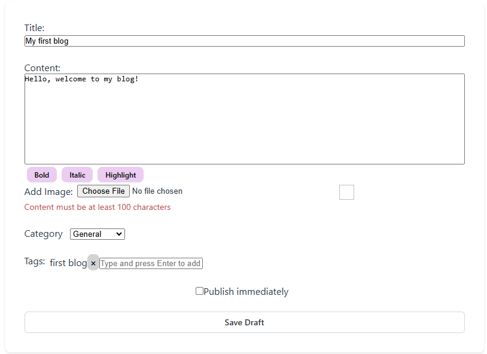
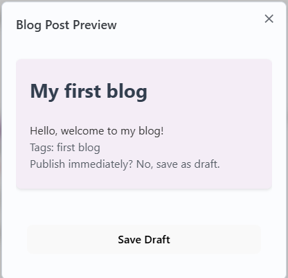
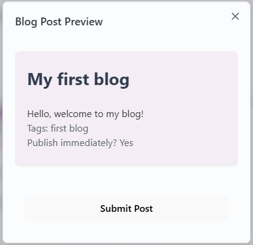
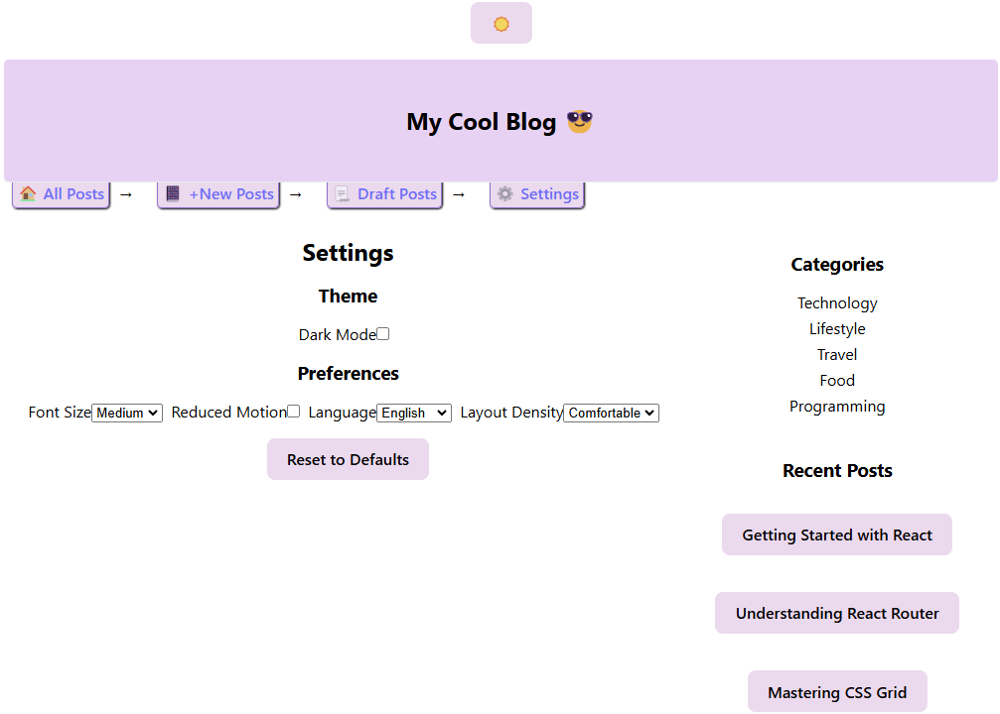

# My React Blog

A blog platform built with React and Vite.
This project currently only has a header and main component.

## Setup Instructions

1. Clone the repository
2. Run `npm install`
3. Run `npm run dev`
4. Open http://localhost:5173 in your browser

## Project Structure
```
react-blog/
├── .gitignore
├── README.md
├── package.json
├── vite.config.js
└── src/
    ├── components/
    ├── contexts/
    ├── data/
    ├── hooks/
    ├── pages/
    ├── providers/
    ├── router/
    ├── settings/
    ├── utils/
    ├── App.jsx
    ├── i18n.jsx
    ├── main.jsx
    └── index.css
```

## Project Structure
- Main/App:
    - Theme Error Boundary: Handle errors
    - Theme Provider: Consistent style
    - Preference Provider: User's settings
    - Theme Toggle: Light and dark mode
    - Router Provider: Dynamic navigation
- Layout:
    - Navigation
    - Outlet: Render Nested routes
    - Sidebar
- Navagations Links:
    - All Posts
        - BlogList: Container for multiple posts
        - BlogPost: Individual blog post display
            - Comment Section
            - Like Button
    - New Posts
        - Post Editor: Form 
            - Tag Input
            - Rich Text Editor 
            - Modal to preview post
            - Hooks for handling image upload and form validation. 
    - Draft Posts: 
    - Settings:
        - Theme: Light or Dark Mode
        - Font size: Small, Medium, Large
        - Layout Density: Comfortable or Compact
        - (Pending) Language: English, Spanish, French and Reduced Motion
    

## Screenshot
| Description | Image |
| ----------- | ----------- |
| 0. First Draft |    |
| 1. Desktop Format  |  |
| 2. Mobile Format |  |
| 3. Blog Post |  |
| 4. Preview of post: Save Draft *(Button Color in photo not updated)*|  |
| 5. Preview of post: Publish Post *(Button Color in photo not updated)* |  |
| 6. Updated navigation, added sidebar, toggle dark/light mode, and settings. |  |

## Styling Approach

- Color Theme: Purple
- Added some emojis for contrast.
- Each blog post is separated into its own container to differentiate between the different posts.
- Error message in red to catch user's attention to ensure that the user follows form requirement for blog post.

## New Features
- List of blog post with title, content, author, date, and time it takes to read stored into a separate blog data file. 
- Shadow effect on hover and active links and buttons 
- For blog post, user is required in form to have: title (5 character), content (100 characters), and one tag. 
- Uploading an image
- Live preview of post in a modal
- If user checks "publish immediately", button will change to "Publish Post." Otherwise, it would be "Save Draft" 
- Cache user's input in new post and save user's setting [theme (light/dark), font size, layout density (comfortable/compact)]
- Added search, filter, and pagination. 
- Routes and path to multiple links for a more dynamic navigation. 
- Implemented theming for consistent design across application. 
- Optimize performance with custom hooks, memoization, and debouncing.
