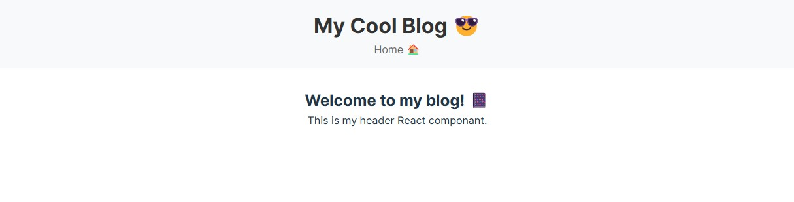
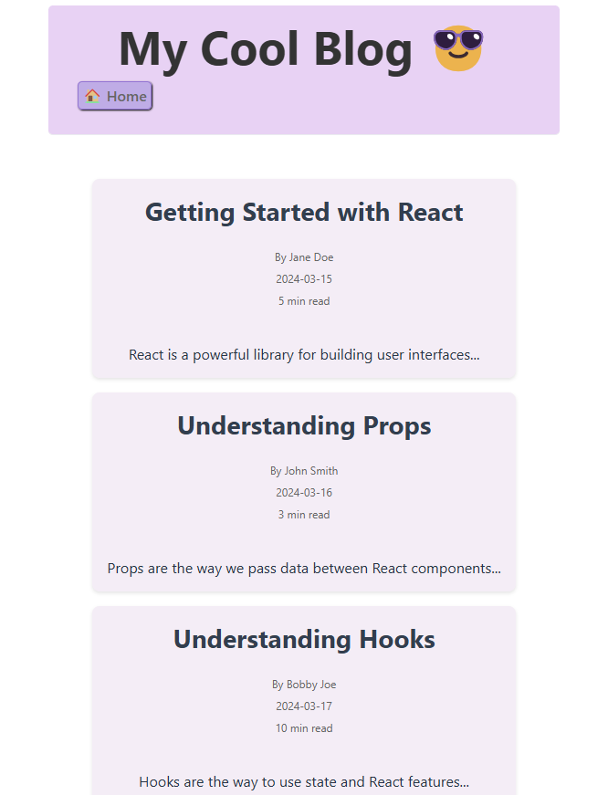
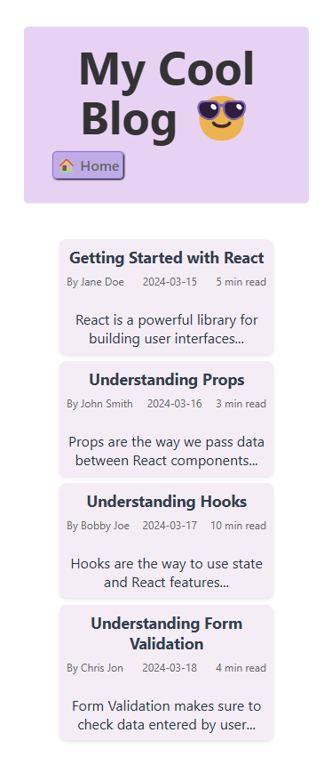

# My React Blog

A blog platform built with React and Vite.
This project currently only has a header and main component.

## Setup Instructions

1. Clone the repository
2. Run `npm install`
3. Run `npm run dev`
4. Open http://localhost:5173 in your browser

## Project Structure
```
react-blog/
├── .gitignore
├── README.md
├── package.json
├── vite.config.js
└── src/
    ├── components/
    │   └── BlogPost
    │   └── BlogList
    │   └── Header
    ├── data/
    │   └── post.js
    ├── App.jsx
    ├── main.jsx
    └── index.css
```

## Components Structure

- Header: Navigation and site title
- BlogList: Container for multiple posts
- BlogPost: Individual blog post display

## Screenshot
First Draft <br>

Desktop Format

Mobile Format <br>

## Styling Approach

- Color Theme: Purple
- Added some emojis for contrast.
- Each blog post is separated into its own container to differentiate between the different posts.

## New Features
- List of blog Post that contains the title, content, author, date, and time it takes to read. 
- Blog post with prop types.
- A separate file to store the blog data.
- Shadow effect on hover and active.