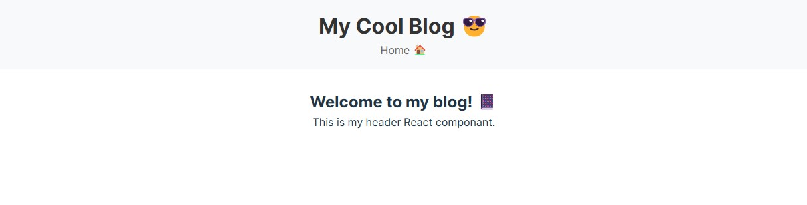

# My React Blog

A blog platform built with React and Vite.
This project currently only has a header and main component.

## Setup Instructions

1. Clone the repository
2. Run `npm install`
3. Run `npm run dev`
4. Open http://localhost:5173 in your browser

## Project Structure

```
react-blog/
├── .gitignore
├── README.md
├── package.json
├── vite.config.js
└── src/
    ├── components/
    │   └── Header.jsx
    ├── App.jsx
    ├── main.jsx
    └── index.css
```

## Screenshot



## What I Learned

1. Using echo to create a .gitignore file that ignores multiple files and directories with a single command in the terminal.
2. A refresher on how to create a React project with Vite.

---

This following section inside the file doesn't seem to work.

```
lsof -i :5173 k
kill -9 <PID>
```
